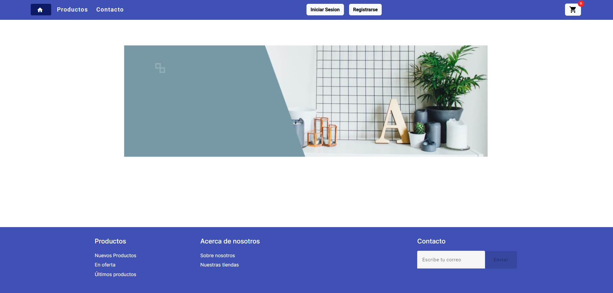
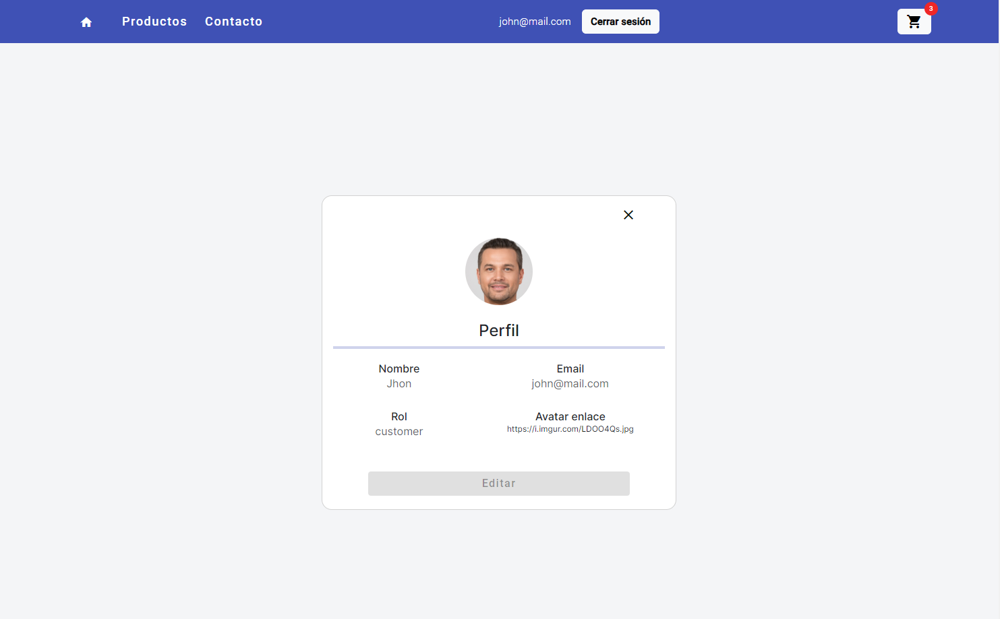
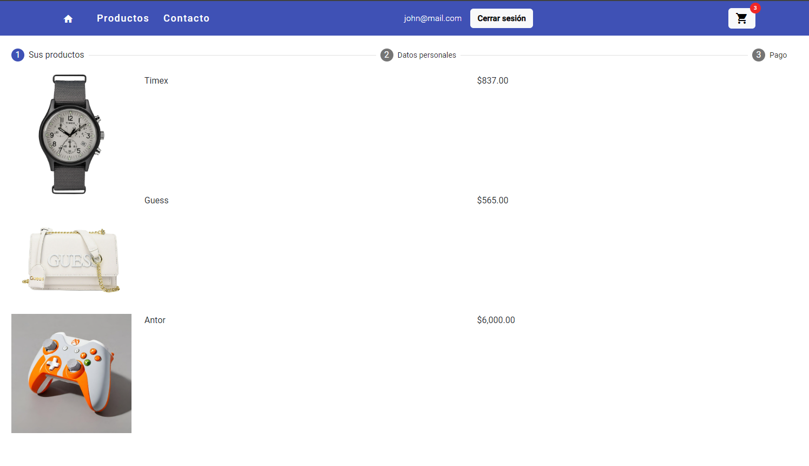
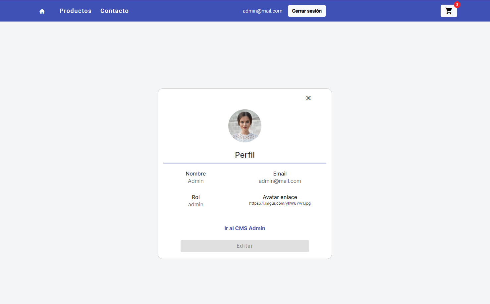
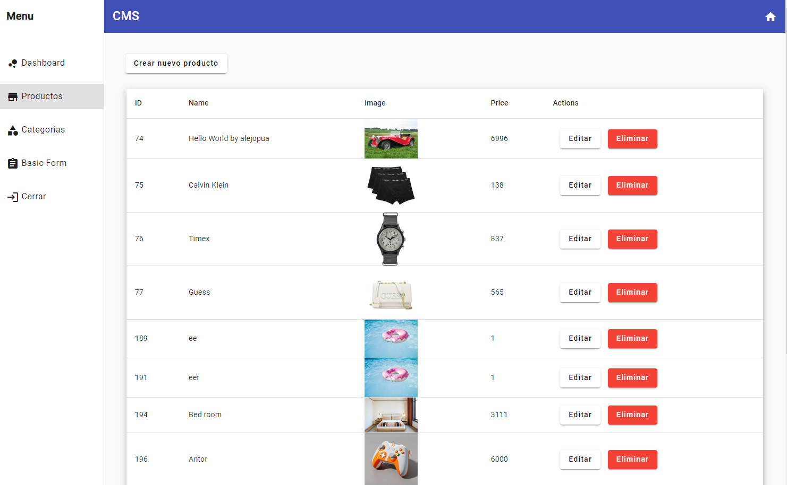

# Admin-panel

- La aplicación esta desplegada en Netlify: [Link](https://cms-ec-admin.netlify.app/)

Esta aplicacion web esta desarrollada en Angular, permite a los usuarios explorar e interactuar con una amplia gama de productos en línea, se mejoro el carrito de compras para que el usuario customer pueda ver sus productos agregados, aparte esta version cuenta con un panel o CMS que permite al usuario autenticado como administrador ingresar a esta interfaz donde podra mofidicar la lista de productos y categorias.

Usuarios para iniciar sesion:

- Customer: "email":"john@mail.com","password":"changeme"
- Administrador: "admin@mail.com","password":"admin123"

## Tabla de Contenidos

- [Admin-panel](#admin-panel)
  - [Tabla de Contenidos](#tabla-de-contenidos)
  - [Introducción](#introducción)
  - [Características Principales](#características-principales)
  - [Capturas de Pantalla](#capturas-de-pantalla)
  - [Instalación](#instalación)
  - [Uso](#uso)
  - [Tecnologías Utilizadas](#tecnologías-utilizadas)

## Introducción

Esta aplicacion desarrollada con Angular aparte de tener un comercio electronico para los usuarios tambien cuenta con un panel para que el administrador pueda manipular los datos de productos como categorias directamente con la API. En conclusion el administrador puede hacer un CRUD desde su panel.

## Características Principales

- 🚧 Búsqueda de productos 🚧
- 🚧 Carrito de compras 🚧
- 🚧 Registro y autenticación de usuarios 🚧
- 🚧 Integración con API externa de productos🚧
- 🚧 Programación modular 🚧
- 🚧 Navegación entre rutas 🚧
- 🚧 Despliegue a producción 🚧

## Capturas de Pantalla

Capturas de pantalla:

Home 

Perfil customer 

Carrito de compras 

Perfil administrador 

Panel o CMS 

## Instalación

Proporciona instrucciones claras y concisas para que otros desarrolladores puedan configurar y ejecutar tu proyecto en sus entornos locales. Esto puede incluir:

1. Clonar el repositorio:  
   `git clone https://github.com/Dev-Joshua/admin-panel-angular`

2. Navegue al directorio del proyecto:  
   `cd admin-panel-angular`

3. Instalar dependencias:  
   `npm install`

4. Ejecutar la aplicación:  
   `ng serve`  
   Abra su navegador y vaya a http://localhost:4200.

## Uso

Para comenzar a usar admin-panel, siga estos pasos:

1. Explore la página de inicio para ver productos destacados.

2. Si desea registrarse puede hacerlo accediendo al componente de registro a traves de la barra nav.
3. Puede iniciar sesion con cualquiera de los siguientes usuarios predeterminados. Uno tiene el rol de admin y el otro solo es un usuario customer que podra ver unicamente los productos.
4. Si inicio sesion como administrador puede entrar al panel desde su perfil dandole click al nombre de su usuario en la barra nav y luego accediendo desde el boton "Ir al CMS Admin".

5. En la interfaz principal de la tienda puede dar click en un producto para ver más detalles activando el slide, accediendo al product-detail.

6. Agregue productos al carrito de compras del nav.

7. Si desea ver la interfaz de registro, login o profile-edit. Puede acceder desde los botones en la barra de navegacion.

## Tecnologías Utilizadas

Tecnologías y herramientas que se implementaron:

- HTML
- SCSS
- Angular
- Angular Material
- TypeScript
- Consumo API REST

Link de la API: https://fakeapi.platzi.com/
